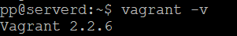

# Домашнее задание к занятию "5.2. Применение принципов IaaC в работе с виртуальными машинами"


## Задача 1

- Опишите своими словами основные преимущества применения на практике IaaC паттернов.

```
- Скорость и уменьшение затрат: позволяет быстрее конфигурировать инфраструктуру и направлен на обеспечение прозрачности.
- Восстановление в аварийных ситуациях: эффективный способ отслеживания вашей инфраструктуры и повторного развертывания
последнего работоспособного состояния после сбоя или катастрофы любого рода.
- Безопасность и документирование: за провижен всех вычислительных, сетевых и служб хранения отвечает код,
они каждый раз будут развертываться одинаково. Т.к. код можно версионировать, IaaC позволяет документировать, регистрировать
и отслеживать каждое изменение конфигурации вашего сервера.
- Масштабируемость и стандартизация: развертывания инфраструктуры с помощью IaaC повторяемы и предотвращают проблемы во время
выполнения, вызванных дрейфом конфигурации или отсутствием зависимостей. IaaC полностью стандартизирует сетап инфраструктуры,
что снижает вероятность ошибок или отклонений.
```

- Какой из принципов IaaC является основополагающим?
```
Идемпотентность - свойство объекта или операции при повторном применении операции к объекту давать тот же результат,
что и при первом.
```

## Задача 2

- Чем Ansible выгодно отличается от других систем управление конфигурациями?
```
- При неуспешной доставке конфигурации на сервер, оповестит об этом.
- Для описания конфигурационных файлов используется удобный для чтения формат YAML.
- Работает без агента на клиентах, используя ssh для доступа.
- Ansible Galaxy - огромное комьюнити, где можно найти практически любое решение.
```

- Какой, на ваш взгляд, метод работы систем конфигурации более надёжный push или pull?
```
Имееют права на жизнь оба метода. И различные инструменты управления конфигурацией заточены под тот или иной метод.
Со слов лектора метод pull требует меньше ресурсов для развертывания.
Предполагаю что метод будет наиболее надежным в зависимости от условий и знания администратора(человеческий фактор может генерировать ошибки и уязвимости). 
```


## Задача 3

Установить на личный компьютер:

- VirtualBox
pp@serverd:~$ vboxmanage --version  


- Vagrant  
pp@serverd:~$ vagrant -v  
Vagrant 2.2.6  


- Ansible


*Приложить вывод команд установленных версий каждой из программ, оформленный в markdown.*

## Задача 4 (*)

Воспроизвести практическую часть лекции самостоятельно.

- Создать виртуальную машину.
Приложенная конфигурация к лабе из коробки не работает Имеются рекомендации "Начиная с VirtualBox 6.1.28, сетевые адаптеры только для хоста по умолчанию ограничены IP-адресами в диапазоне 192.168.56.0/21 (192.168.56.1 -> 192.168.63.254)."  
Сеть в файле NET = "192.168.192." изменена на NET = "192.168.56."
- Зайти внутрь ВМ, убедиться, что Docker установлен с помощью команды
```
docker ps
```


